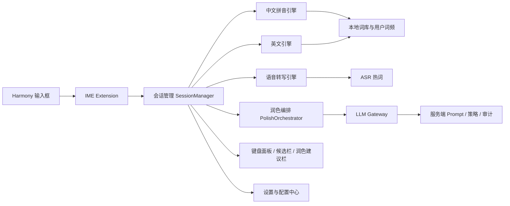

# 总体方案

## 1. 产品目标

打造一款面向 HarmonyOS NEXT 的原生输入法，形成“基础输入稳定可离线、智能能力按需启用、润色结果可控可预览”的产品体验。

核心目标：

- 在无网络情况下，完整支持中文拼音和英文输入。
- 在有网络且用户授权的前提下，支持服务端 LLM 对输入文本做轻润色、正式化、去口语化处理。
- 支持语音转写，语音结束后提供原文与润色候选。
- 在密码、验证码、锁屏密码、敏感安全模式下，自动关闭学习、云端、润色和语音上传。
- 整体输入延迟接近系统输入法，核心按键到候选刷新保持毫秒级。

## 2. 非目标

以下内容不纳入第一阶段：

- 手写输入
- 日语、韩语等多语种复杂输入法
- 云端候选实时生成替代本地解码
- 自动无提示改写已提交文本
- 完整跨设备同步与多端词库冲突解决

## 3. 用户价值

面向三类核心场景：

| 场景 | 用户诉求 | 方案能力 |
| --- | --- | --- |
| 聊天沟通 | 快速输入、少改错字、发出去更自然 | 拼音/英文输入、语音转写、轻润色、口语清洗 |
| 办公沟通 | 邮件、IM、会议纪要更正式 | 正式化模式、行业词库、专有名词热词、风格模板 |
| 内容创作 | 输入流畅、可连续写作 | 长句候选、联想补全、语音转写、段落级润色建议 |

## 4. 能力矩阵

| 能力 | 离线可用 | 首版必做 | 二期增强 |
| --- | --- | --- | --- |
| 中文全拼 | 是 | 是 | 双拼、模糊音增强 |
| 英文输入 | 是 | 是 | 自动纠错、短语扩展 |
| 语音转写 | 视设备能力 | 是 | 断句优化、说话人场景适配 |
| LLM 云端润色 | 否 | 是 | 多风格模板、企业私有化模型 |
| 端侧 LLM 兜底 | 是 | 否（骨架预留） | 端侧小模型去口语/轻改写 |
| 用户词库学习 | 是 | 是 | 云同步 |
| 热词下发 | 否 | 是 | 实时灰度下发 |

### 4.1 端侧 LLM 兜底路径

为了避免被云端 LLM SLA 绑架，设计上预留端侧推理插槽：

- 接口层：`PolishOrchestrator` 输出与云端同构的 `PolishSuggestion`，调用方不感知是端侧还是云侧。
- 实现层：首版不实装端侧模型，仅提供 `LocalPolishEngine` 抽象与 noop 实现。
- 二期（P2）：基于 `MindSpore Lite Kit` 加载 `<= 300MB` 量化小模型，能力范围收敛到“去口语 / 句式清理”，不做事实改写。
- 降级规则：云端超时、熔断、或用户关闭云服务时，若端侧可用则切端侧；端侧不可用则仅保留原文。

## 5. 体验原则

1. 基础输入永远先于智能能力。没有 LLM、没有网络、没有语音服务时，输入法依然可用。
2. 智能能力只做增强，不抢控制权。润色默认以建议形式出现，而不是静默篡改用户原文。
3. 语音与 LLM 必须可解释。用户要能看到原文、润色结果和差异。
4. 敏感场景默认保守。密码、验证码、安全模式一律禁用学习与云端。
5. 配置必须分层。系统级、用户级、场景级、编辑框级都可叠加决策。

## 6. 总体架构

## 7. 关键设计决策

### 7.1 输入与润色分层

- “输入引擎”负责把按键或语音变成稳定文本。
- “润色引擎”负责在文本已经可读的前提下做风格提升。
- 两者不能耦合为一条强依赖链路，否则无网时输入体验会直接退化。

### 7.2 LLM 触发方式

建议采用三种触发模式：

- 手动触发：点击“润色”按钮后请求服务端。
- 语音结束自动给建议：展示原文和润色建议，默认不自动替换。
- 长按发送键联动：在聊天场景中，用户可选择“发送前润色”。

不建议首版做：

- 每次候选变化都请求 LLM
- 用户停止敲击 300ms 就自动改写全文

### 7.3 场景分流

根据输入框类型、系统安全模式、宿主应用额外配置和当前子类型，做策略决策：

- `TEXT` / `MULTILINE`：允许拼音、英文、语音、润色
- `EMAIL_ADDRESS` / `URL`：禁用润色，优先英文
- `NUMBER` / `PHONE`：切换数字布局，禁用润色
- `VISIBLE_PASSWORD` / `NUMBER_PASSWORD` / `SCREEN_LOCK_PASSWORD` / `ONE_TIME_CODE`：禁用学习、语音、云端、润色

## 8. 关键指标

建议以以下指标作为验收目标：

| 指标 | 目标 |
| --- | --- |
| 冷启动到键盘首帧 | `< 350ms` |
| 单次按键到候选更新 P50 | `< 35ms` |
| 单次按键到候选更新 P95 | `< 70ms` |
| 中文 Top10 候选命中率 | `> 95%` |
| 英文纠错接受率 | `> 60%` |
| 语音首个部分结果 | `< 400ms` |
| 语音最终结果 | `< 1.2s` |
| LLM 轻润色返回 P95 | `< 1.5s` |
| HAP 基础包大小 | `< 25MB`（不含可选词库/模型） |
| 键盘常驻内存 | `< 120MB` |
| 基础词库常驻内存 | `< 40MB` |
| 端侧润色模型（P2） | `< 300MB`，按需下载 |

## 9. 版本规划

### P0：基础 MVP

- 中文全拼
- 英文输入
- 候选栏
- 用户词频学习
- 手动 LLM 润色
- 设置页

### P1：智能增强

- 语音输入
- 语音结束自动给润色建议
- 行业热词
- 模糊音与中英混输

### P2：体验完善

- 双拼
- 云热词与词库更新
- 多风格润色模板
- 企业私有化网关

### P3：生态扩展

- 用户词库云同步
- A/B 实验平台
- 多端共享风格偏好
