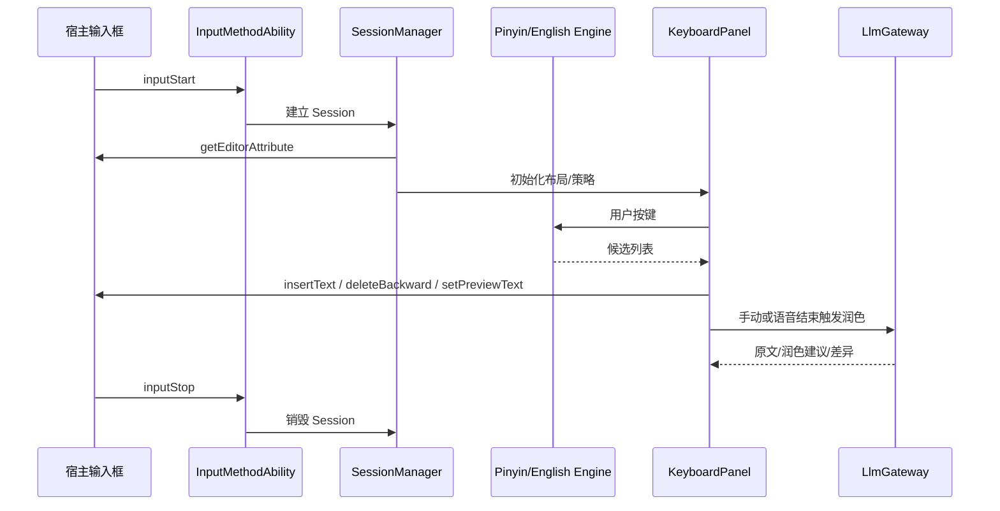

# 鸿蒙 IME 工程架构

## 1. 当前工程现状

当前仓库是一个标准 HarmonyOS 应用模板，`entry` 模块内只有 UIAbility 页面，还未引入输入法扩展能力。

已确认的本机工具链信息：

- `targetSdkVersion`: `6.0.2(22)`
- 当前 SDK 提供 `IMEKit`
- 当前 SDK 提供 `InputMethodExtensionAbility`
- 当前 SDK 提供 `inputMethodEngine.InputMethodAbility`
- 当前 SDK 提供 `PanelInfo / PanelType / PanelFlag`
- 当前 SDK 提供 `InputMethodSubtype`
- 当前 SDK 提供 `EditorAttribute.extraConfig`
- 当前 SDK 提供 `CoreSpeechKit` 的 `speechRecognizer`

## 2. 推荐工程拆分

首版仍建议保持单 HAP 交付。由于中文拼音核心将采用 `librime`，目录建议分为 ArkTS 层与 Native 层两部分：

```text
entry/src/main/
  ets/
    app/
      settings/
      onboarding/
    ime/
      ability/
        OffhandInputMethodExtensionAbility.ets
      panel/
        KeyboardPanel.ets
        CandidateBar.ets
        PolishSuggestionBar.ets
        VoicePanel.ets
      session/
        SessionManager.ets
        EditorContextAdapter.ets
        SecurityPolicy.ts
      engine/
        english/
        ranking/
        compose/
        rime/
          RimeService.ts
          CandidateAdapter.ts
          RimeOptionMapper.ts
      voice/
        SpeechRecognizerAdapter.ts
        VoiceSessionManager.ts
      polish/
        PolishOrchestrator.ts
        LlmGateway.ts
        PromptBuilder.ts
      data/
        LexiconRepository.ts
        UserDictionaryStore.ts
        HotwordRepository.ts
      config/
        ConfigRepository.ts
        FeatureFlagStore.ts
  cpp/
    CMakeLists.txt
    rime/
      RimeBridge.cpp
      RimeSession.cpp
      RimeDataManager.cpp
      RimeOptionBridge.cpp
      rime_bridge.h
  resources/base/rawfile/
    rime/shared/
      default.yaml
      offhand_pinyin.schema.yaml
      offhand.base.dict.yaml
      offhand_pinyin.custom.yaml
```

说明：

- `ets/ime/engine/rime` 只负责 ArkTS 侧调用、候选适配、线程与状态管理，不直接实现拼音算法。
- `cpp/rime` 通过 Harmony 原生桥接层封装 `librime` C API。
- `resources/base/rawfile/rime/shared` 放只读共享数据；用户学习产生的数据放应用私有目录。

## 3. HarmonyOS 关键能力映射

### 3.1 输入法扩展入口

基于本机 SDK 声明，输入法扩展入口为 `InputMethodExtensionAbility`，负责：

- 生命周期管理
- 创建输入法上下文
- 初始化面板与会话管理器

### 3.2 输入法事件与客户端

基于 `inputMethodEngine.InputMethodAbility`：

- `inputStart`：建立输入会话，拿到 `KeyboardController` 和 `InputClient`
- `inputStop`：清理 composing buffer 和会话态
- `keyboardShow` / `keyboardHide`：管理面板显隐
- `setSubtype`：切换中文 / 英文 / 语音子类型
- `securityModeChange`：安全模式切换，动态收紧能力

### 3.3 面板能力

当前 SDK 支持创建：

- `SOFT_KEYBOARD`
- `STATUS_BAR`

`SOFT_KEYBOARD` 支持：

- `FLAG_FIXED`
- `FLAG_FLOATING`
- `FLAG_CANDIDATE`

建议首版：

- 主键盘使用 `SOFT_KEYBOARD + FLAG_FIXED`
- 候选栏内嵌在主键盘顶部
- 语音状态栏、润色建议栏以主面板内部组件实现

### 3.4 `librime` 集成定位

中文拼音核心建议改为：

- `librime` 负责拼音解析、分段、候选生成、用户学习、方案配置
- ArkTS 负责键盘 UI、候选条、功能键、策略决策、语音与 LLM 编排
- Native Bridge 负责会话创建、按键转发、上下文读取、候选选择和用户数据同步

边界约束：

- 不在 ArkTS 侧重复实现拼音 DAG、分段和候选召回
- 不把 `librime` 直接暴露给 UI 组件，而是经 `RimeService` 做二次封装
- 英文输入仍保留轻量本地引擎，避免把全部英文纠错逻辑硬塞进 Rime 方案

## 4. 宿主输入框适配

通过 `InputClient.getEditorAttribute()` 和 `EditorAttribute` 读取：

- 输入框类型
- 回车键语义
- 占位文案
- Ability 名称
- `extraConfig`

基于这些信息进行策略决策：

| 信息 | 用途 |
| --- | --- |
| `textInputType` | 决定键盘布局与是否禁用润色 |
| `enterKeyType` | 设置回车键文案，如发送、搜索、完成 |
| `placeholder` | 推断当前场景，如“搜索”优先禁用润色 |
| `abilityName` | 结合应用白名单做场景映射 |
| `extraConfig` | 宿主应用传入更明确的策略提示 |

## 5. 安全模式与敏感场景

当前 SDK 提供 `SecurityMode.BASIC` 与 `SecurityMode.FULL`。

设计规则：

| 条件 | 学习词频 | 语音 | 云热词 | LLM 润色 |
| --- | --- | --- | --- | --- |
| `BASIC + TEXT` | 开 | 开 | 开 | 开 |
| `BASIC + EMAIL/URL` | 开 | 关 | 开 | 关 |
| `BASIC + PASSWORD/OTP` | 关 | 关 | 关 | 关 |
| `FULL` | 关 | 关 | 关 | 关 |

## 6. 建议的 Extension 配置样例

参考样例见：

- `design/config/module-extension.sample.json5`

### 6.1 ExtensionAbility

- `extensionAbilities[].type` 已由本机 SDK schema 确认为 `inputMethod`
- `exported` 必须为 `true`，否则系统输入法框架无法启用该 Ability
- `srcEntry` 指向继承 `InputMethodExtensionAbility` 的入口文件

### 6.2 metadata 键名

`metadata.name` 在不同 API 版本上键名不完全一致，落地时按 SDK 头文件为准。候选键名优先级：

1. `ohos.extension.input_method`（API ≥ 12 常见）
2. `ohos_extension.input_method`（早期示例写法）
3. `input_method`（老模板）

建议构建期通过 hvigor 插件做一次校验：读取 `sdk/.../input_method_config.json` 的 schema `$id`，反推应写入的 metadata 键。若无法反推则保留键名 `ohos.extension.input_method`，并在 QA 阶段用真机 `bm dump -n <bundle>` 校验 `InputMethodExtensionAbility` 是否被正确注册。

`resource` 指向 `resources/base/profile/input_method_config.json`，内容为子类型清单，示例见 [03-中文拼音与英文输入引擎设计.md](./03-中文拼音与英文输入引擎设计.md) §2。

### 6.4 Rime 数据资源

采用 `librime` 后，需要额外准备两类目录：

- 共享只读目录：`resources/base/rawfile/rime/shared`
- 用户可写目录：`<app_private>/rime`

共享目录包含：

- `default.yaml`
- `*.schema.yaml`
- `*.dict.yaml`
- `*.custom.yaml`
- 预编译后的 `build/` 产物（如决定首版预编译）

用户目录包含：

- 用户学习数据
- 用户自定义词条
- deploy 过程中生成的缓存
- 运行态日志或状态文件

### 6.3 必需权限

| 权限 | 用途 | 申请方式 |
| --- | --- | --- |
| `ohos.permission.INTERNET` | 云端润色、词库与热词下发 | `normal`，静态声明 |
| `ohos.permission.GET_NETWORK_INFO` | 弱网降级判断 | `normal` |
| `ohos.permission.MICROPHONE` | 语音输入 | `user_grant`，首次使用语音时弹窗 |
| `ohos.permission.KEEP_BACKGROUND_RUNNING` | 长会话语音保持 | `normal`，按需 |
| `ohos.permission.CONNECT_IME_ABILITY` | 系统级 IME 扩展通信（系统应用场景） | `system_core`，三方普通场景不申请 |

注意：

- 麦克风是 `user_grant`，必须在 `module.json5` 的 `requestPermissions[].reason` 中给出中文说明，并在首次进入语音态时通过 `abilityAccessCtrl.requestPermissionsFromUser` 动态申请。
- 不申请 `ohos.permission.READ_CLIPBOARD` 与 `ohos.permission.READ_CONTACTS`，避免触发敏感权限审核。

## 7. 输入会话时序



## 8. 关键实现接口建议

### 8.1 SessionManager

职责：

- 保存当前 `InputClient`
- 保存 `EditorAttribute`
- 保存当前子类型
- 暴露安全策略决策
- 协调中文、英文、语音、润色模块

### 8.2 EditorContextAdapter

职责：

- 对 `insertText` / `deleteBackward` / `setPreviewText` 做统一封装
- 处理同步与异步 API 差异
- 处理 selection、cursor 和 preview text

### 8.3 ConfigRepository

职责：

- 装载默认配置
- 合并远程灰度配置
- 合并用户设置
- 合并编辑框 `extraConfig`
- 生成 `librime` 运行时选项映射（schema、switch、patch、用户目录）

## 9. 推荐的实现策略

1. 先把输入法当成“离线输入引擎 + 面板 UI”做扎实。
2. 在会话层加一个明确的策略决策器，统一处理安全模式、输入框类型、宿主提示。
3. 中文拼音优先依赖 `librime` 的 schema、词典与用户学习能力，不在 ArkTS 重复造轮子。
4. 语音和 LLM 都通过能力开关接到会话层，而不是直接侵入键盘组件。
5. 所有云能力必须支持超时、熔断与降级，失败后不影响继续输入。

## 10. 预览态与编辑客户端契约

`InputClient` 暴露的文本写入 API 在 API 22 的行为约束如下，设计必须显式规定调用纪律，避免宿主输入框状态混乱：

### 10.1 三类文本写入

| API | 语义 | 可撤销 | 是否产生选区 |
| --- | --- | --- | --- |
| `insertText(text)` | 真正提交文本到宿主 | 由宿主 undo 栈决定 | 否 |
| `setPreviewText(text, range)` | 在宿主上显示未提交的预览片段 | 必须配对 `finishTextPreview` | 否 |
| `deleteForward/deleteBackward(length)` | 基于当前光标的字符删除 | 否 | 否 |

### 10.2 调用纪律

1. `setPreviewText` 必须幂等：同一 composing buffer 每次刷新只调用一次最新完整文本，禁止追加式 diff 调用。
2. 每个 `setPreviewText` 必须在以下任一时机之前配对 `finishTextPreview`：
   - 用户选中某个候选并 `insertText`
   - `inputStop` 生命周期回调
   - 子类型切换（`setSubtype`）
   - 安全模式升级（`securityModeChange` 收紧）
3. 预览态期间宿主若抛出 `selectionChange`，视为用户手动操作，立即 `finishTextPreview` 并清空 composing。
4. 语音部分结果仅允许在宿主支持 `setPreviewText` 时使用预览态展示；否则降级到“键盘内置语音条”展示，不侵入宿主。
5. `inputStop` 回调内必须执行 `finishTextPreview` + `engine.reset()`，即便上层抛异常也要保证调用（`try/finally`）。

### 10.3 异常兜底

- 调用写入 API 抛异常：记录一次 `HiSysEvent`，将 composing buffer 清空，提示“输入已恢复”，不中断键盘。
- 宿主进程崩溃：`onInputStop` 未被回调的风险存在，`SessionManager` 需订阅 `AbilityLifecycleCallback`，在会话超时（默认 30 分钟无活动）时主动清理。
