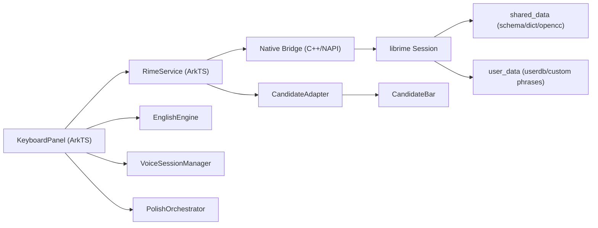
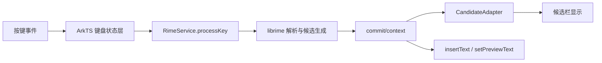

# 中文拼音与英文输入引擎设计（基于 librime）

## 1. 设计目标

- 中文拼音核心引擎使用 `librime`，避免重复实现拼音切分、候选生成、用户学习与方案 DSL。
- 英文输入保留轻量本地引擎，保证英文体验与中文拼音核心解耦。
- 中英混输、模糊音、简拼、用户词频学习优先复用 Rime 现成能力。
- 所有基础输入能力在离线状态下可用。

## 2. 为什么选 `librime`

采用 `librime` 的原因：

- 官方定位就是跨平台输入法核心引擎，已在多个桌面和移动前端中长期使用。
- 提供 schema YAML、dictionary YAML、用户学习、OpenCC 转换、Spelling Algebra 等成熟能力。
- 适合把“算法与词库层”从 ArkTS UI 层剥离出来。
- 许可上 `librime` 核心为 BSD-3-Clause，更适合做底层库集成。

采用后的职责边界：

- `librime`：中文拼音解析、候选生成、用户学习、方案配置。
- ArkTS 面板层：按键 UI、候选显示、功能键、语音与 LLM 流程、策略决策。
- 本地英文引擎：英文自动大小写、轻量拼写纠错、短语联想。

## 3. 子类型与 Rime 方案映射

推荐至少定义三个子类型：

| subtypeId | 语言 | Rime schemaId | 说明 |
| --- | --- | --- | --- |
| `zh-Hans-pinyin` | `zh-CN` | `offhand_pinyin` | 中文全拼主模式 |
| `zh-CN-voice` | `zh-CN` | `offhand_pinyin` | 语音优先模式，共用同一拼音方案但打开语音偏置策略 |
| `zh-Hans-double-pinyin` | `zh-CN` | `offhand_double_pinyin` | 二期扩展 |

英文子类型建议保留：

| subtypeId | 语言 | 引擎 | 说明 |
| --- | --- | --- | --- |
| `en-US-qwerty` | `en-US` | `local_english` | 英文 QWERTY 主模式 |

说明：

- 中文方案使用 Rime schema 驱动。
- 英文不强依赖 Rime；首版采用轻量本地英文引擎更容易保证体验。
- 中文子类型切换，本质上映射到不同的 `schemaId` 或一组 Rime option patch。

## 4. 总体架构

设计原则：

- UI 与引擎彻底分层。
- `librime` 全部运行在 Native Worker 线程，不阻塞 ArkTS 主线程。
- ArkTS 只拿经过适配的上下文和候选，不直接处理 Rime 原生结构体。

## 5. `librime` 会话模型

建议在客户端侧封装一组稳定接口：

| ArkTS 封装方法 | 底层职责 |
| --- | --- |
| `init()` | 初始化 `librime` 环境与目录 |
| `deployIfNeeded()` | 首次运行或升级时 deploy 共享数据 |
| `createSession(schemaId)` | 建立输入会话 |
| `processKey(keyCode, mask)` | 转发按键到 Rime |
| `getContext()` | 读取 composition、preedit、候选列表 |
| `getCommit()` | 读取已提交文本 |
| `selectCandidate(index)` | 选中候选 |
| `clearComposition()` | 清空组合态 |
| `setOption(name, value)` | 设置 option，如 `ascii_mode` |
| `syncUserData()` | 后台同步用户学习数据 |
| `destroySession()` | 销毁会话 |

生命周期建议：

- `inputStart`：创建或复用 session，切换 schema 与 options。
- 普通按键：调用 `processKey()`，随后拉取 `commit/context`。
- 候选点击：调用 `selectCandidate(index)`，再取一次 `commit/context`。
- `inputStop`：清空组合态，必要时同步用户数据。

## 6. 中文输入处理流程

前端约束：

- 每次按键后优先取 `commit`，有 committed text 就立即写入宿主输入框。
- 如果只有 `context`，则显示 preedit 和候选列表。
- 删除键优先交给 `librime` 处理 composition；composition 为空时再删宿主文本。
- 空格键优先走 Rime 当前候选提交逻辑，而不是前端自行猜测上屏。

## 7. Rime 方案设计

### 7.1 首版方案建议

首版建议自定义一个 `offhand_pinyin.schema.yaml`，但建立在官方 `luna_pinyin_simp` 思路之上。

建议组合：

- 基础 schema：`offhand_pinyin`
- 基础词典：`offhand.base.dict.yaml`
- 行业词典：`offhand.domain.<name>.dict.yaml`
- 热词补丁：`offhand.hotword.dict.yaml`
- 用户补丁：`offhand_pinyin.custom.yaml`

推荐资源样例：

- [design/config/offhand_pinyin.schema.yaml.sample](/Users/richie/Documents/others/harmony-open-offhand/design/config/offhand_pinyin.schema.yaml.sample)
- [design/config/offhand.base.dict.yaml.sample](/Users/richie/Documents/others/harmony-open-offhand/design/config/offhand.base.dict.yaml.sample)
- [design/config/offhand_pinyin.custom.yaml.sample](/Users/richie/Documents/others/harmony-open-offhand/design/config/offhand_pinyin.custom.yaml.sample)

### 7.2 建议启用的 Rime 能力

首版建议启用：

- 全拼
- 基础简拼
- `v -> ü`
- 模糊音
- `ascii_mode`
- 标点切换
- 用户词频学习

首版暂不启用：

- `librime-lua`
- `librime-predict`
- `librime-octagram`
- 多插件复杂联想

原因：

- 先把 Harmony 原生集成、部署与会话稳定性做好。
- 预测和语言模型插件会显著增加编译、包体和调试复杂度。

## 8. 中英混输策略

采用 `librime` 后，中英混输应拆成两层：

### 8.1 中文侧

由 Rime 负责：

- 拼音输入
- `ascii_mode` 下的英文直通
- 部分中英混输时的 raw input 保留

### 8.2 英文侧

由本地英文引擎负责：

- 自动首字母大写
- 双击空格插句号
- 基础自动纠错
- 英文短语联想

前端合并规则：

- 当前是中文子类型时，候选栏以 Rime 候选为主，英文引擎只作为补充建议源。
- 当前是英文子类型时，完全走英文引擎，不启动 Rime 中文候选流程。
- 邮箱、URL、代码片段等场景优先切英文或直接开启 `ascii_mode`。

## 9. 词频学习与用户数据

Rime 自带用户学习能力，但本项目仍建议保留上层策略控制：

允许学习：

- 普通文本输入框
- 用户明确选择候选
- 用户主动添加短语

禁止学习：

- 密码、验证码、锁屏密码
- `SecurityMode.FULL`
- 用户关闭个性化学习

用户数据建议拆成两层：

- Rime `user_data`：用户学习、deploy 缓存、用户词典
- App 业务存储：功能开关、学习总开关、同步状态、词库版本号

## 10. 性能目标

| 模块 | 目标 |
| --- | --- |
| `librime` 初始化（冷启动） | `< 250ms` |
| 首次 deploy（后台） | `< 2s`，且不阻塞首次基本输入 |
| 单次按键到候选更新 P50 | `< 35ms` |
| 单次按键到候选更新 P95 | `< 70ms` |
| 候选栏刷新 | `< 16ms` |

性能策略：

- 初始化与 deploy 走后台线程
- 会话对象单线程串行访问
- 共享数据尽量预编译打包
- 避免每次按键都做重型 ArkTS 数据转换

## 11. 失败回退策略

如果 `librime` 初始化失败或 schema 资源损坏：

- 中文输入回退到最简占位模式，提示“拼音引擎不可用”
- 自动禁用用户学习与行业词库增益
- 仍保留英文输入、数字输入和设置页
- 打点记录错误，但不让整个输入法崩溃

如果只是某个 schema patch 失败：

- 回退到 `fallbackSchemaId`
- 继续允许基本中文候选输入

## 12. 关键决策

这套方案下，项目的真正技术重点不再是“自研拼音算法”，而是：

1. HarmonyOS 上把 `librime` 编译、打包、部署和调用稳定。
2. 把 Rime 上下文无损适配到我们的 ArkTS 候选 UI。
3. 把语音、LLM 和安全策略叠加在 Rime 之上，而不是侵入 Rime 本体。
