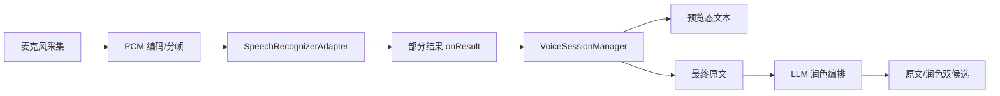

# 语音输入与 LLM 润色设计

## 1. 语音输入目标

- 在聊天、会议纪要、备忘录等场景下提升长文本输入效率。
- 输出分为“原始转写结果”和“润色建议结果”两层，避免黑盒改写。
- 支持部分结果实时显示，结束后可继续编辑。

## 2. Harmony 语音能力选型

当前本机 SDK 已提供 `CoreSpeechKit` 中的 `speechRecognizer` 能力。

已确认的关键接口约束：

- 通过 `createEngine()` 创建识别引擎
- 通过 `setListener()` 接收识别事件
- 通过 `startListening()` 启动会话
- 通过 `writeAudio()` 持续写入音频
- 单次音频块长度要求为 `640` 或 `1280`
- 通过 `finish()` 完成识别
- 通过 `onResult()` 接收部分结果和最终结果

## 3. 语音输入链路



## 4. 音频采集建议

推荐默认参数：

- `audioType`: `pcm`
- `sampleRate`: `16000`
- `soundChannel`: `1`
- `sampleBit`: `16`

分帧策略：

- 以 20ms 或 40ms 为发送周期
- 每帧封装成 `640` 或 `1280` 字节
- 在主线程之外完成缓冲和送写

## 5. 语音会话状态机

```text
IDLE
 -> PREPARING
 -> LISTENING
 -> PARTIAL_RESULT
 -> FINAL_RESULT
 -> POLISHING
 -> DONE
 -> ERROR
```

行为规则：

- `LISTENING` 阶段展示声波动画与部分转写
- `FINAL_RESULT` 阶段冻结原文
- `POLISHING` 阶段展示“润色建议生成中”
- `DONE` 阶段提供“上屏原文 / 上屏润色”两个入口

## 6. LLM 润色目标

类似 typeless 的价值不在“重写”，而在“保留原意，提升表达”。因此建议将首版润色目标收敛为：

- 去除口头语
- 修正常见语病
- 调整语气更自然或更正式
- 不新增事实
- 不删减关键实体名、数字、时间、地名

## 7. 润色模式

建议支持四种模式：

| 模式 | 用途 |
| --- | --- |
| `light` | 轻润色，只去口语与重复 |
| `formal` | 更正式，适合邮件与办公 IM |
| `clear` | 精简清晰，适合纪要和笔记 |
| `friendly` | 语气更自然亲和，适合聊天 |

默认建议：

- 聊天：`light`
- 邮件：`formal`
- 笔记：`clear`
- 语音输入：`light`

## 8. 润色触发策略

### 8.1 允许触发

- 用户点击键盘上的“润色”按钮
- 语音最终结果出来后自动给建议
- 宿主应用通过 `extraConfig` 明确声明允许自动润色建议

### 8.2 禁止触发

- `SecurityMode.FULL`
- 密码、验证码、URL、邮箱、数字输入框
- 文本长度超过最大阈值且当前网络质量差
- 用户关闭云服务

## 9. LLM 网关设计

### 9.1 客户端侧模块

- `PolishOrchestrator`：决定是否请求、何时请求、请求什么
- `PromptBuilder`：根据模式拼装提示词
- `DiffBuilder`：计算原文与建议差异
- `LlmGateway`：负责网络请求、重试、超时、熔断
- `LocalPolishEngine`：端侧兜底接口，首版 noop，P2 由 MindSpore Lite 实装
- `TextRedactor`：上行前的客户端侧脱敏过滤器

### 9.2 服务端侧模块

- API Gateway
- 鉴权与配额控制
- Prompt 模板管理
- 模型路由
- 审计与脱敏日志
- 策略回包

详细后端设计见 [08-LLM后端服务设计.md](./08-LLM后端服务设计.md)。

### 9.3 上行脱敏规则

客户端侧在调用 `LlmGateway.polish()` 之前必须先过 `TextRedactor`。规则如下：

| 类别 | 匹配模式（示例，按优先级顺序） | 处置 |
| --- | --- | --- |
| 手机号（中国大陆） | `(?<!\d)1[3-9]\d{9}(?!\d)` | 替换为 `<PHONE>` |
| 身份证 | `(?<!\d)\d{17}[\dXx](?!\d)` | 整条请求直接拒绝（`abortReason=PII_ID`） |
| 银行卡 | `(?<!\d)\d{15,19}(?!\d)` | 整条请求直接拒绝（`abortReason=PII_BANK`） |
| 邮箱 | `[\w.+-]+@[\w-]+\.[\w.-]+` | 替换为 `<EMAIL>` |
| URL | `https?://\S+` 或 `\b[\w.-]+\.[a-z]{2,}/\S*` | 替换为 `<URL>` |
| OTP / 验证码 | 上下文窗口含“验证码/校验码/code/OTP”且后续 4-8 位数字 | 整条请求直接拒绝 |
| IPv4/IPv6 | 常规 IP 正则 | 替换为 `<IP>` |
| 纯数字段（长度 ≥ 10） | `\d{10,}` | 替换为 `<NUM>` |

执行规则：

1. 脱敏后的文本才是服务端收到的 `text` 字段；客户端保留原文用于展示。
2. 替换占位符在服务端 Prompt 中需被指示“保留原样、不改写”，见 [08-LLM后端服务设计.md](./08-LLM后端服务设计.md) §5。
3. 若整条拒绝，`PolishOrchestrator` 应在 UI 层给出“已包含敏感信息，已停止上传”非阻断提示。
4. `TextRedactor` 的命中结果本身只做客户端埋点（分类 + 计数），不上传原始命中片段。
5. 正则集应通过配置中心下发，允许快速修正，版本号随请求携带（`redactorVersion`）。

## 10. 服务端 API 建议

```json
{
  "requestId": "uuid",
  "locale": "zh-CN",
  "mode": "light",
  "scene": "chat",
  "text": "我刚刚大概就是说这个事情其实已经弄完了，你看要不要再过一下",
  "source": "voice",
  "preserveLineBreaks": true,
  "preserveEntities": true,
  "sensitive": false,
  "clientHints": {
    "bundleName": "com.xxx.im",
    "subtypeId": "zh-CN-voice",
    "abilityName": "ChatAbility"
  }
}
```

期望返回：

```json
{
  "requestId": "uuid",
  "originalText": "我刚刚大概就是说这个事情其实已经弄完了，你看要不要再过一下",
  "polishedText": "这件事我刚刚已经处理完成了，你看是否还需要再确认一下。",
  "alternatives": [
    "这件事我已经处理完了，你看是否需要再确认一下。",
    "这件事刚刚已经完成，你可以再过目一次。"
  ],
  "safetyAction": "allow",
  "latencyMs": 620
}
```

## 11. Prompt 策略

建议服务端维护模板，客户端只传模式与约束，避免在客户端硬编码大段 prompt。

基础模板原则：

- 保留原意
- 不新增事实
- 保留数字、专有名词和时间信息
- 默认输出单条最佳结果
- 支持场景化风格指令

示例系统提示：

```text
你是输入法的文本润色助手。请在不改变事实和意图的前提下，
把用户文本改写得更自然、更清晰，减少口语化、重复词和赘余语气词。
如果原文已经足够好，只做最小改动。
```

## 12. 用户体验建议

建议键盘顶部提供三段式结果：

- 左侧：原文按钮
- 中间：润色建议按钮
- 右侧：差异高亮入口

替换规则：

- 默认点击“润色建议”后替换当前选中片段或最近一段已提交文本
- 不做静默替换
- 允许一键撤销回原文

## 13. 失败与降级

| 异常 | 降级策略 |
| --- | --- |
| 无网络 | 若端侧可用走端侧润色；否则仅保留原文，不弹失败窗 |
| 超时 | 给出“原文已可直接上屏”，自动退到端侧或原文 |
| 服务端拒绝 | 给出非阻断提示，记录 `safetyAction` |
| 脱敏命中整条拒绝 | UI 提示“已包含敏感信息，已停止上传” |
| 熔断打开 | 隐藏自动润色建议，仅保留手动入口 |
| 安全模式切换 | 立即取消语音和润色请求，调用 `finishTextPreview` |

## 14. 关键风险

- 语音识别能力在不同设备上的可用性可能不同，需要设备能力探测
- 服务端 LLM 如果延迟波动大，会直接影响用户对“输入法是否卡顿”的感知
- 如果缺乏明确 diff 展示，用户会担心文本被擅自改写
