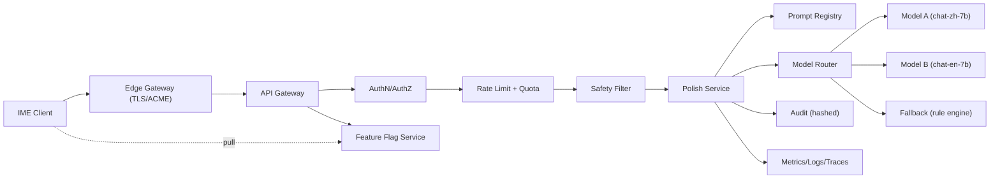

# LLM 后端服务设计

## 1. 定位与目标

LLM 后端（下称 `offhand-llm`）是输入法的**有状态最少、可观测最充分、可回退可灰度**的润色服务。

核心目标：

- 在不改变用户原意的前提下，对中文/英文文本做轻润色、正式化、精简、口语清理。
- 对客户端保证稳定的 P95 延迟（`< 1.5s`）与可预测的成本。
- 不保存原文，仅保留脱敏审计摘要用于滥用治理与问题定位。
- 支持多模型路由、灰度、熔断、私有化部署。

非目标（首版）：

- 生成长文、事实改写、多轮对话记忆
- 云端候选替代本地解码
- 用户画像与个性化训练

## 2. 总体架构



分层职责：

| 层 | 组件 | 职责 |
| --- | --- | --- |
| 边缘 | `Edge Gateway` | TLS 终结、证书轮换、全球加速、WAF |
| 接入 | `API Gateway` | 路由、协议校验、请求 ID、熔断 |
| 安全 | `AuthN/AuthZ`、`Rate Limit`、`Safety Filter` | 设备鉴权、配额、内容安全 |
| 业务 | `Polish Service` | 润色编排、Prompt 组装、模型路由 |
| 支撑 | `Prompt Registry`、`Feature Flag`、`Model Router` | 模板与策略热更新、模型灰度 |
| 模型 | `Model A/B/Fallback` | 推理执行 |
| 观测 | `Audit`、`Metrics/Logs/Traces` | 可观测与合规 |

## 3. 部署形态

| 形态 | 适用场景 | 模型托管 |
| --- | --- | --- |
| `public` | C 端公共服务 | 自托管 7B 级中文/英文模型 + 托管云服务兜底 |
| `enterprise` | 企业私有部署 | 客户自选：开源权重（Qwen/Baichuan/Llama）或接入自建网关 |
| `edge-lite` | 合规敏感区域 | 规则引擎 + 小参数模型，能力受限 |

部署通过同一份 OpenAPI 与 `deploymentProfile` 字段区分，客户端不感知。

## 4. 接口契约

### 4.1 `POST /v1/polish`

请求头：

```
Authorization: Bearer <device_jwt>
X-Request-Id: <uuid-v4>
X-Client-Version: 1.0.0
X-Redactor-Version: 2026.04.1
Content-Type: application/json
```

请求体：

```json
{
  "requestId": "uuid",
  "locale": "zh-CN",
  "mode": "light",
  "scene": "chat",
  "text": "我刚刚大概就是说这个事情其实已经弄完了，你看要不要再过一下",
  "source": "voice",
  "preserveLineBreaks": true,
  "preserveEntities": true,
  "sensitive": false,
  "maxCandidates": 2,
  "clientHints": {
    "bundleName": "com.xxx.im",
    "subtypeId": "zh-CN-voice",
    "abilityName": "ChatAbility"
  }
}
```

字段约束：

| 字段 | 类型 | 必填 | 约束 |
| --- | --- | --- | --- |
| `requestId` | string | 是 | uuid v4，全链路唯一 |
| `locale` | string | 是 | BCP-47，`zh-CN` / `en-US` / `zh-HK` |
| `mode` | enum | 是 | `light` / `formal` / `clear` / `friendly` |
| `scene` | enum | 否 | `chat` / `mail` / `note` / `search` / `generic` |
| `text` | string | 是 | 已客户端脱敏，长度 `1..1500`（字符数） |
| `source` | enum | 否 | `keyboard` / `voice` / `paste` |
| `preserveLineBreaks` | bool | 否 | 保留换行 |
| `preserveEntities` | bool | 否 | 保留数字、专名、时间 |
| `sensitive` | bool | 否 | 客户端额外声明，服务端再次校验 |
| `maxCandidates` | int | 否 | `1..3`，默认 1 |

响应：

```json
{
  "requestId": "uuid",
  "originalText": "……",
  "polishedText": "……",
  "alternatives": ["……"],
  "diff": [{ "op": "replace", "start": 0, "end": 3, "text": "这件事" }],
  "safetyAction": "allow",
  "modelTag": "zh-polish-7b-20260401",
  "promptVersion": "zh.polish.light.v3",
  "latencyMs": 620,
  "degraded": false
}
```

`safetyAction` 取值：`allow` / `soft_block`（返回原文且给提示）/ `hard_block`（429/451）。

### 4.2 `POST /v1/polish:stream`

SSE 流式返回，事件：

- `partial`：增量文本片段
- `final`：完整结果（同 4.1 响应体）
- `error`：错误码与可读消息

用于 `formal` 等较长文本场景，客户端可提前展示。

### 4.3 `GET /v1/flags`

返回灰度配置与 kill switch，客户端每 5 分钟拉一次：

```json
{
  "version": "2026.04.21.1",
  "ttlSec": 300,
  "disableLlmPolish": false,
  "disableVoiceAutoPolish": false,
  "maxTextLength": 1500,
  "timeoutMs": 1500
}
```

### 4.4 `POST /v1/feedback`

用户接受/拒绝/回退原文的匿名反馈（不含原文）：

```json
{
  "requestId": "uuid",
  "action": "accept|reject|revert",
  "modelTag": "zh-polish-7b-20260401",
  "promptVersion": "zh.polish.light.v3"
}
```

### 4.5 错误码

| HTTP | code | 含义 | 客户端处理 |
| --- | --- | --- | --- |
| 400 | `invalid_request` | 字段缺失或越界 | 不重试，上报 |
| 401 | `unauthorized` | token 失效 | 刷新设备 JWT 后一次重试 |
| 403 | `forbidden` | 区域/策略禁止 | 关闭本会话自动润色 |
| 413 | `text_too_long` | 超过 `maxTextLength` | 客户端截断或拒绝 |
| 422 | `redaction_required` | 服务端二次检测到 PII | 不重试 |
| 429 | `rate_limited` | 配额耗尽 | 指数退避，默认 60s |
| 451 | `content_blocked` | 安全策略硬拦截 | 直接丢弃，不重试 |
| 499 | `client_cancel` | 客户端取消 | 服务端尽快中止 |
| 500 | `internal_error` | 未分类 | 最多一次重试 |
| 503 | `circuit_open` | 熔断 | 进入本地熔断，停用自动润色 |
| 504 | `model_timeout` | 模型超时 | 降级返回原文 |

## 5. Prompt 管理

### 5.1 模板结构

Prompt Registry 存储版本化模板，按 `(locale, mode, scene)` 三元组寻址：

```yaml
id: zh.polish.light.v3
locale: zh-CN
mode: light
scene: chat
system: |
  你是输入法的文本润色助手。请在不改变事实和意图的前提下，
  把用户文本改写得更自然、更清晰，减少口语化、重复词和赘余语气词。
  如果原文已经足够好，只做最小改动。

  硬性约束：
  1. 不新增事实、人名、数字、时间、地名。
  2. 保留所有 `<PHONE>` `<EMAIL>` `<URL>` `<IP>` `<NUM>` 占位符原样，不改写，不补全。
  3. 输出仅包含润色后的文本，禁止包含解释或引号。
  4. 输出长度不得超过原文长度的 1.3 倍。
user: |
  【原文】
  {{text}}
constraints:
  maxInputChars: 1500
  maxOutputChars: 1950
  temperature: 0.3
  topP: 0.9
  stop: ["\n\n\n"]
```

### 5.2 模板治理

- 模板以 Git 仓库存储，合并前需通过 50 条黄金样例回归（BLEU/ChrF + 人工评估）。
- 灰度按 `promptVersion` 维度，支持 1% → 10% → 50% → 100%。
- `promptVersion` 随响应回传，用于 A/B 与用户反馈归因。
- 禁止在客户端硬编码 Prompt；客户端仅传 `mode` 与 `scene`。

### 5.3 占位符兼容

Prompt 必须显式告知模型保留客户端脱敏占位符（见 [04-语音输入与LLM润色设计.md §9.3](./04-语音输入与LLM润色设计.md)）。服务端在输出后会做二次校验：

- 输入中出现的占位符必须在输出中同数量出现。
- 若不满足，回退到规则引擎或返回原文。

## 6. 模型路由

### 6.1 路由维度

| 维度 | 说明 |
| --- | --- |
| `locale` | `zh-*` 走中文模型，`en-*` 走英文模型 |
| `mode` | `formal` / `clear` 可走更强模型 |
| `textLength` | `< 80` 字走轻量模型，`≥ 80` 走标准模型 |
| `latencySlo` | P95 目标，影响是否启用投机解码 |
| `tenant` | 企业租户走专属池 |

### 6.2 推理后端

- **首选自托管**：Qwen2.5-7B-Instruct 量化版（INT8/AWQ），使用 vLLM/TensorRT-LLM，开启 continuous batching 与投机解码。
- **兜底托管**：第三方托管模型（作为超时/熔断降级，合规区域可禁用）。
- **规则引擎**：基于词典 + 正则的口语清理器（去“就是/大概/那个/嗯”等填充词），离线可用，不依赖模型。

### 6.3 SLO 与容量

| 指标 | 目标 |
| --- | --- |
| P50 端到端 | `< 600ms` |
| P95 端到端 | `< 1500ms` |
| 模型可用性 | `99.9%` |
| 单实例 QPS | `≥ 12`（7B 量化，A10/昇腾 Atlas 300I） |
| 缓存命中率 | `≥ 15%`（语义+精确双层） |

## 7. 安全过滤

### 7.1 三道过滤

1. **入口正则二次脱敏**：与客户端同源的规则集，版本号来自 `X-Redactor-Version`，不一致时以更严格者为准。
2. **分类器**：轻量文本分类（暴恐/色情/政治敏感/辱骂），命中走 `soft_block`（返回原文）或 `hard_block`（451）。
3. **输出过滤**：对模型输出做同样分类；若输出新增了输入中没有的命名实体（人名/地名/机构），按“可能幻觉”降级到规则引擎或回退原文。

### 7.2 越狱与 Prompt 注入

- 系统消息使用角色隔离，用户文本始终作为 `user` 消息并包裹在 `【原文】` 块中。
- 剥离常见注入模式：`忽略以上指令`、`you are now`、Markdown 代码围栏突破等；命中不直接拒绝，而是转义后继续。
- 输出若包含典型指令性语句（"好的，我会..."），触发自我检查重生成一次。

## 8. 鉴权与配额

### 8.1 设备鉴权

- 客户端出厂或首次启动时通过 `POST /v1/devices:register` 上报去标识设备指纹（不含 IMEI/MAC）。
- 服务端下发短期 JWT（2h），刷新使用 refresh token（30 天），刷新失败回退到匿名配额池。
- JWT `sub` 为设备随机 ID；不绑定真实用户身份。

### 8.2 配额

| 维度 | 默认 |
| --- | --- |
| 设备 QPS | 2 |
| 设备日额度 | 500 次 |
| 租户 QPS | 按合同 |
| 单请求最大字符 | 1500 |

超额返回 429，并在 `Retry-After` 声明建议退避。

## 9. 审计与合规

### 9.1 数据最少化

- 请求体入库前，`text` 与 `polishedText` 做 SHA-256（加盐，每日轮换 salt）后仅保留 hash 与长度。
- 原文与输出**不进入任何持久化存储**，仅在推理进程内存中存在，请求结束立即清理。
- 日志字段白名单：`requestId`, `deviceIdHash`, `locale`, `mode`, `scene`, `textLen`, `textHash`, `outputLen`, `outputHash`, `modelTag`, `promptVersion`, `latencyMs`, `safetyAction`, `errorCode`。

### 9.2 合规能力

- 用户可通过 `DELETE /v1/devices/{deviceIdHash}` 触发服务端侧 `deviceIdHash` 与所有关联 hash 的级联删除。
- 支持区域化部署，`zh-CN` 流量默认不跨境。
- 提供审计导出 API，仅对企业租户与合规审计方开放，结果为 hash 化聚合数据。

### 9.3 模型训练隔离

- 线上请求**不用于训练**。
- 训练数据只来自显式采集的评估集与授权语料；写入训练集需双人审批并留痕。

## 10. 可观测性

### 10.1 指标

- RED：Rate / Errors / Duration，按 `route`、`locale`、`mode`、`modelTag`、`promptVersion` 打维度。
- 业务：`polish_accept_rate`、`polish_revert_rate`、`safety_block_rate`、`placeholder_preserve_fail_rate`。
- 成本：按 `modelTag` 记 `tokens_in/out`、`gpu_ms`。

### 10.2 日志与追踪

- OpenTelemetry 贯通 Gateway → Polish → Model。
- `traceId == requestId`，便于与客户端 `HiAppEvent` 对账。

### 10.3 告警

- P95 延迟连续 5 分钟超 1.5s 告警
- 5xx 比例 > 1% 告警
- `placeholder_preserve_fail_rate > 2%` 触发 Prompt 回滚流程
- 任何 `content_blocked` 突增 3 倍触发安全复盘

## 11. 熔断与降级

客户端与服务端双层熔断：

- 服务端：对下游模型做 `hystrix` 风格熔断，触发后路由到规则引擎，响应带 `degraded=true`。
- 客户端：5 分钟内 `5xx + 超时 ≥ 20` 时本地 kill 自动润色，仅保留手动入口。
- 灰度层：任何一层异常均可被 `Feature Flag Service` 远程关闭。

## 12. 成本模型

近似估算（7B 量化，A10/同等算力）：

| 项 | 估值 |
| --- | --- |
| 平均输入 | 80 tokens |
| 平均输出 | 60 tokens |
| 单请求 GPU 耗时 | `~250ms` |
| 每 GPU 每秒吞吐 | `~12 req` |
| 1M 请求边际成本 | 约 1 GPU·日 + 网络带宽 |

控制策略：

- 短文（`< 20` 字符）直接走规则引擎，不进模型。
- 相同 `(textHash, mode, scene, promptVersion)` 走 Redis LRU 缓存（TTL 1h），不含原文，仅命中时重放缓存结果的 `polishedText`（也以 hash 校验）。
- 语义缓存二期再启用，需评估相似度阈值带来的漂移风险。

## 13. 技术栈建议

| 层 | 选型 |
| --- | --- |
| Gateway | Envoy / APISIX |
| 业务服务 | Go（延迟敏感路径）或 Rust；Python 仅在离线任务 |
| 推理 | vLLM（NVIDIA）/ MindSpore Lite Serving（昇腾） |
| 存储 | Redis（缓存与限流）、PostgreSQL（审计 hash 与配置）、对象存储（模型权重） |
| 配置 | etcd / Nacos（Prompt、Flag 热更新） |
| 观测 | Prometheus + Loki + Tempo + Grafana |
| CI/CD | GitHub Actions / GitLab CI，Prompt 与模型权重独立流水线 |

## 14. 里程碑

| 里程碑 | 范围 |
| --- | --- |
| B1 | 单区域部署，`/v1/polish` 同步接口，规则引擎 + 7B 中文模型，基础鉴权与限流 |
| B2 | 英文模型、`/v1/polish:stream`、Prompt Registry、Feature Flag、熔断 |
| B3 | 安全三道过滤、审计 hash 化、kill switch、可观测面板 |
| B4 | 企业私有部署模板、合规导出、成本优化（缓存 + 投机解码） |
| B5 | 多区域、模型灰度、反馈闭环、自动 Prompt 评估 |

## 15. 风险与应对

| 风险 | 影响 | 应对 |
| --- | --- | --- |
| 模型幻觉改写事实 | 用户信任崩塌 | Diff 强制展示 + 占位符校验 + 规则引擎兜底 |
| 延迟抖动 | 用户感知卡顿 | 客户端降级 + 服务端熔断 + 规则引擎 |
| 合规审查要求公开训练数据 | 业务停摆 | 严格“线上请求不训练”，保留审批留痕 |
| 成本超支 | 不可持续 | 短文规则化 + 缓存 + 配额 |
| 跨境数据流动 | 法律风险 | 区域化部署 + `zh-CN` 默认不出境 |
