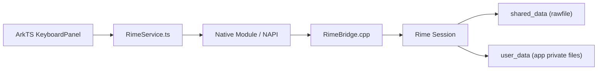

# librime 拼音引擎集成方案

## 1. 文档目标

本文件专门回答一个问题：

如何在 HarmonyOS 原生输入法工程中，把 `librime` 作为中文拼音核心引擎稳定地集成进去。

它关注的是：

- Native 编译与打包
- ArkTS 与 C++ 的桥接接口
- Rime schema/dict 资源组织
- 会话、候选、用户学习和 deploy 生命周期

它不重复讲输入法产品需求和 LLM 设计，相关内容见：

- [02-鸿蒙IME工程架构.md](./02-鸿蒙IME工程架构.md)
- [03-中文拼音与英文输入引擎设计.md](./03-中文拼音与英文输入引擎设计.md)
- [05-词库体系设计.md](./05-词库体系设计.md)

## 2. 采用 `librime` 的定位

采用 `librime` 之后，项目分层明确如下：

| 层 | 负责内容 |
| --- | --- |
| `librime` | 中文拼音解析、候选生成、方案切换、用户学习 |
| Native Bridge | 会话管理、结构体转换、线程隔离 |
| ArkTS | 键盘 UI、候选栏、语音/LLM、安全策略、设置页 |

关键原则：

- 中文拼音算法不在 ArkTS 侧重写。
- ArkTS 永远只操作“桥接后的上下文对象”，不直接依赖 Rime 原生数据布局。
- 所有 `librime` 调用都走单线程串行 worker，避免 session 并发问题。

## 3. 版本与依赖策略

根据官方 `rime/librime` 仓库说明，`librime` 依赖项包括：

- `boost`
- `leveldb`
- `marisa-trie`
- `opencc`
- `yaml-cpp`
- `glog`（可选）

首版建议：

- 锁定一条已在 HarmonyOS 交叉编译验证过的稳定 `librime` release 线
- 关闭可选插件：
  - `librime-lua`
  - `librime-predict`
  - `librime-octagram`
  - `librime-proto`
- `glog` 也建议首版关闭，统一走 Harmony 日志体系

这样做的目的：

- 降低包体与 native 依赖复杂度
- 控制首次集成难度
- 优先验证 Rime 主流程而不是高级扩展

## 4. HarmonyOS 集成架构



### 4.1 共享数据

共享只读资源建议放在：

`entry/src/main/resources/base/rawfile/rime/shared`

包括：

- `default.yaml`
- `*.schema.yaml`
- `*.dict.yaml`
- `*.custom.yaml`
- 预编译后的 `build/` 产物（如果采用预编译打包）

### 4.2 用户数据

可写目录建议放在应用私有文件目录下：

`<app_private>/rime`

包括：

- `*.userdb`
- deploy 后生成的缓存
- 用户自定义词库

## 5. Native Bridge 设计

建议只暴露最小、稳定、面向前端语义的接口：

| 接口 | 说明 |
| --- | --- |
| `init(sharedDataDir, userDataDir)` | 初始化 Rime 运行环境 |
| `deployIfNeeded()` | 首次运行或版本更新时部署资源 |
| `createSession(schemaId)` | 创建输入会话 |
| `destroySession(sessionId)` | 销毁会话 |
| `processKey(sessionId, keyCode, modifier)` | 转发按键 |
| `getState(sessionId)` | 返回 preedit、candidates、commit、options |
| `selectCandidate(sessionId, index)` | 选择候选 |
| `setSchema(sessionId, schemaId)` | 切换方案 |
| `setOption(sessionId, optionName, value)` | 切换 ascii_mode 等 |
| `clearComposition(sessionId)` | 清空组合态 |
| `syncUserData()` | 后台同步用户学习数据 |

`getState()` 建议桥接成统一 JSON/结构对象，而不是暴露多个低层调用。

## 6. ArkTS 侧适配对象

建议在 ArkTS 侧定义：

```ts
export interface RimeCandidate {
  index: number;
  text: string;
  comment?: string;
}

export interface RimeState {
  schemaId: string;
  composingText: string;
  commitText?: string;
  candidates: RimeCandidate[];
  isAsciiMode: boolean;
}
```

这样 UI 层永远只关心：

- 当前 composition 是什么
- 有没有 commit
- 候选列表长什么样

## 7. Rime 资源组织建议

首版建议资源最小化：

```text
rime/shared/
  default.yaml
  offhand_pinyin.schema.yaml
  offhand.base.dict.yaml
  offhand_pinyin.custom.yaml
```

二期再引入：

- `offhand_double_pinyin.schema.yaml`
- `offhand.domain.office.dict.yaml`
- `offhand.hotword.dict.yaml`

## 8. 方案继承策略

建议分两个阶段：

### 阶段 A：快速起步

- 参考官方 `luna_pinyin` / `luna_pinyin_simp` 的结构
- 自建 `offhand_pinyin.schema.yaml`
- 先保留最核心 processor / segmentor / translator / filter

### 阶段 B：完全自维护

- 把业务需要的拼音规则、模糊音、标点、热词和行业词典都收敛到 `offhand_*` 命名空间
- 与外部第三方方案包彻底解耦

原因：

- 阶段 A 可以快速验证 `librime` 能否在 HarmonyOS 上稳定跑起来。
- 阶段 B 有利于控制 license、发布节奏和长期维护。

## 9. deploy 策略

Rime 的资源不是单纯拷贝过去就能直接用，通常还需要 deploy 或预编译构建。

推荐策略：

### 9.1 首次安装

- 后台执行 `deployIfNeeded()`
- 如果 deploy 尚未完成，中文输入可临时显示“引擎准备中”
- 不阻塞英文输入和设置页

### 9.2 应用升级

- 根据资源版本号判断是否需要重新 deploy
- deploy 成功后再切换到新资源
- 保留上一版本回滚能力

### 9.3 热更新词典

- 下载新的 `*.dict.yaml` 或 patch
- 校验 checksum
- 落盘
- 后台触发一次局部重载或 deploy

## 10. 候选与上屏适配

HarmonyOS 输入法前端不能把 Rime 当黑盒直接塞给宿主，需要做 UI 适配：

1. `processKey()`
2. 读取 `RimeState`
3. 如果 `commitText` 非空，先 `insertText`
4. 如果 `composingText` 或 `candidates` 非空，刷新候选栏
5. 用户点候选后调用 `selectCandidate(index)`

注意：

- 空格键优先交给 Rime 处理，不由前端直接写第一候选。
- 删除键优先清 composition。
- `inputStop` 时强制 `clearComposition()`，避免残留状态污染下一输入框。

## 11. 与英文、语音、LLM 的关系

### 11.1 英文

- 英文主模式仍由本地英文引擎负责。
- 中文模式下，Rime 的 `ascii_mode` 用于英文直通和基础混输。

### 11.2 语音

- 语音最终文本不进入 Rime 重新解码。
- 语音热词可以反向用于生成 Rime 热词字典补丁。

### 11.3 LLM

- LLM 润色发生在“文本已经上屏之后”。
- 不把 LLM 当候选生成器接到 Rime 前面。

## 12. 风险与应对

| 风险 | 说明 | 应对 |
| --- | --- | --- |
| Native 编译复杂 | 依赖较多 | 先做最小依赖集，关闭可选插件 |
| 首次 deploy 偏慢 | schema/dict 编译耗时 | 预编译共享数据，后台 deploy |
| UI 与 Rime 状态不同步 | commit/context 处理不当 | 统一走 `RimeState` 适配层 |
| license 风险 | 官方方案与词库可能是 LGPL | 发布前做合规审查，逐步转为自维护资源 |
| 包体增大 | native 库 + 词库资源 | 控制首版词典规模，按需下发行业包 |

## 13. 首版建议结论

如果要尽快进入开发，建议采取下面这条最稳路线：

1. `librime` 只承担中文拼音核心。
2. 首版 schema 保持极简，不开插件。
3. 英文、语音、LLM 全都放在 Rime 外层。
4. 先跑通：
   - init
   - deploy
   - createSession
   - processKey
   - getState
   - selectCandidate
5. 等主链稳定后，再引入双拼、行业词库和热更新 patch。
